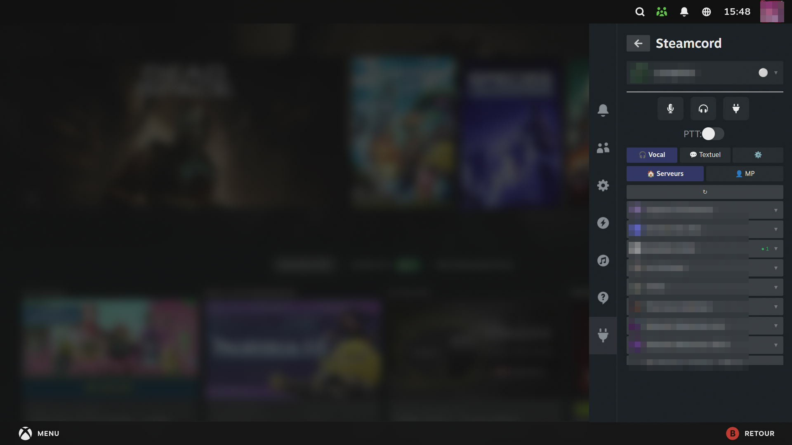
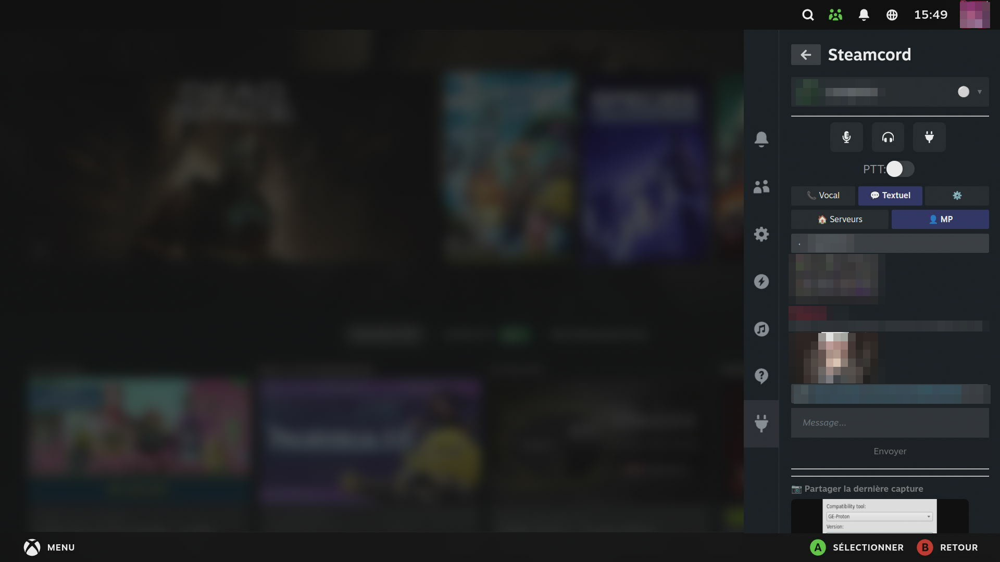
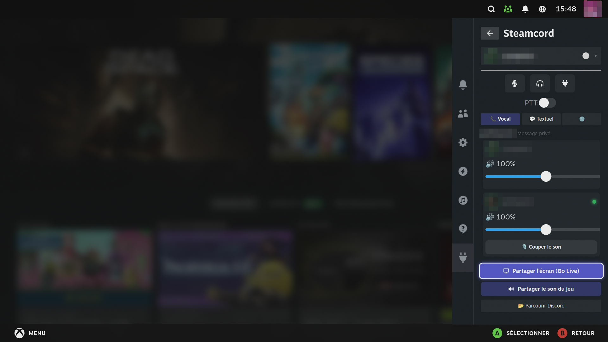
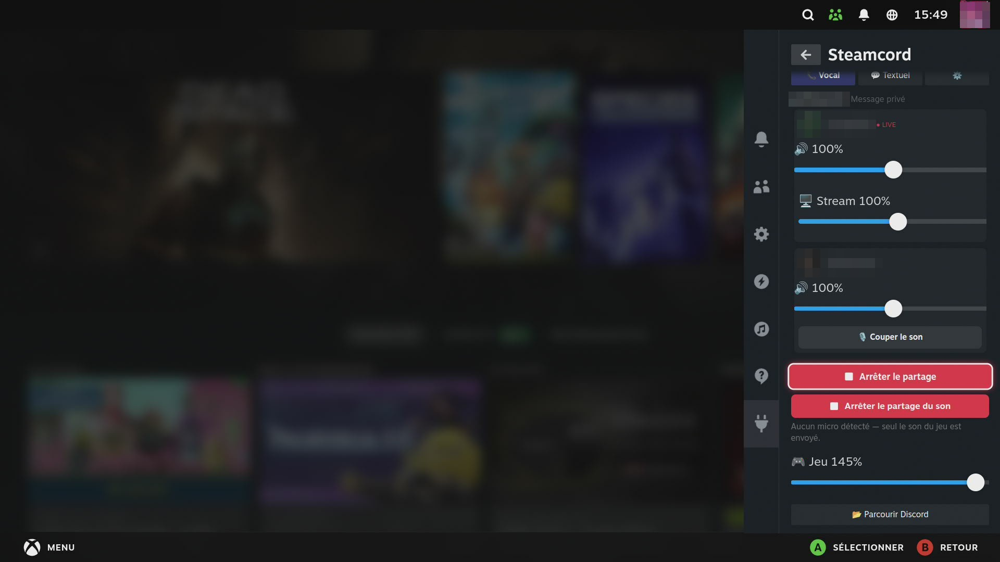

# Steamcord

**Discord no Modo Jogo do Steam** — um plugin [Decky Loader](https://github.com/SteamDeckHomebrew/decky-loader) para Steam Deck / Bazzite / SteamOS.

🌍 **Idiomas:** [English](../README.md) · [Français](README.fr.md) · [Deutsch](README.de.md) · [Español](README.es.md) · [Italiano](README.it.md) · **Português** · [Nederlands](README.nl.md) · [Polski](README.pl.md) · [Русский](README.ru.md)

> **Steamcord é um projeto independente.** Foi originalmente inspirado pelo
> [Deckcord](https://github.com/marios8543/Deckcord) (ver Créditos), mas o código foi
> amplamente reescrito e agora segue sua própria direção — não é afiliado nem endossado
> por esse projeto.
>
> A interface está totalmente traduzida em 9 idiomas e segue automaticamente o idioma do SteamOS.

---

## Como funciona

O Steamcord executa o **[Vesktop](https://github.com/Vencord/Vesktop)** — um cliente Discord nativo de verdade — invisível em segundo plano, e o controla pelo Chrome DevTools Protocol. O plugin injeta um pequeno cliente nele e expõe tudo no **menu de acesso rápido** do Steam.

Ir para o nativo resolve os problemas difíceis da antiga abordagem de navegador oculto: **seu microfone e o áudio de voz funcionam de forma nativa**, exatamente como no app de desktop do Discord — sem truques de captura, sem contornos de autoplay. O Vesktop é iniciado (e instalado se faltar) automaticamente, mantém o login após reiniciar e nunca precisa de uma janela de desktop no Modo Jogo.

---

## Funcionalidades

- **Um Discord por conta Steam (multissessão)** — Cada utilizador Steam da máquina tem **o seu próprio perfil Discord**: mude de conta Steam e o Steamcord troca de Discord automaticamente em segundos (da primeira vez mostra o login por QR; depois cada sessão fica memorizada). Ninguém cai no Discord de outra pessoa.
- **Login por código QR** — Escaneie um código QR com o app do Discord no celular para entrar na hora. No celular: *Discord → Configurações → Ler código QR*, depois aponte para o código mostrado no painel. Sem digitar senha no Deck.
- **Login em tela cheia (alternativa)** — Abre o Discord em tela cheia para entrar com e-mail/senha ou resolver um CAPTCHA quando o QR não é possível.
- **Navegação unificada** — Abas **Voz / Texto / ⚙️ Configurações** no topo, com um seletor **Servidores / DMs** compartilhado logo abaixo: o mesmo interruptor de fonte vale para a voz e para o texto.
- **Chat de voz** — Entre em canais de voz e ouça todos, com cada membro mostrado ao vivo (anel ao falar, selos de mudo/sem áudio), um controle de volume por pessoa (0–200 %) **e um mudo local por pessoa** (silencie alguém só para você, sem que a pessoa saiba). Microfone e áudio nativos (Vesktop).
- **Mensagens diretas (DMs e grupos)** — Navegue pelas suas conversas e inicie/entre em chamadas de voz com amigos direto pelo menu de acesso rápido. Chamadas ativas são destacadas.
- **Navegador de voz dos servidores** — Veja quais canais de voz têm pessoas (com avatares) antes de entrar.
- **Chat de texto — servidores *e* DMs** — Leia e responda a um canal de servidor **ou a uma conversa privada** pelo QAM (campo em largura total, o teclado do Steam abre sozinho). **Imagens anexadas aparecem como miniaturas** (carregadas só enquanto o canal está aberto) e **links abrem no navegador do Modo Jogo**. Rolagem automática até a última mensagem.
- **Status do Discord no seu nome** — Seu **nome de usuário clicável** no topo mostra o status atual; toque nele para mudar. Uma sincronização automática opcional faz o Discord **seguir o seu status do Steam** em segundo plano; escolher um status manualmente volta ao modo manual.
- **Seleção de dispositivos de áudio** — Nas Configurações, escolha o dispositivo de **saída (som do Discord)** e de **entrada (microfone)** — *Auto (padrão do sistema)* ou um específico, p. ex. mandar o som do Discord só para o **fone** enquanto o jogo continua no HDMI.
- **Mudo / Sem áudio / Desconectar** — Controles de voz com um toque pelo QAM.
- **Compartilhar tela** — Compartilhe sua tela inteira em um canal de voz (Go Live). Funciona nativamente no Desktop / Big Picture. **No Modo Jogo (gamescope) está em _beta_:** o gamescope não tem portal de captura de tela (o Go Live normal fica preto), então um botão separado **«Compartilhar tela (modo jogo)»** captura o jogo por uma câmera virtual (v4l2loopback) alimentada diretamente pela saída PipeWire do gamescope — o único caminho de captura que funciona lá. Requer uma configuração única do v4l2loopback.
- **Compartilhar o áudio do jogo** — Transmita o som do seu jogo para o canal de voz **junto com a sua voz**. Dois controles de mixagem (🎙️ voz / 🎮 jogo) definem o que os outros ouvem, enquanto você continua ouvindo o jogo normalmente — e funciona até **sem microfone físico** (o plugin cria uma entrada virtual *Steamcord Mic*).
- **Notificações no jogo** — Chamadas de DM e menções aparecem como **notificações nativas do Steam (popup + som)**, respeitando seu status do Discord (silenciadas em invisível / não perturbe).
- **🕹️ Atalho de controle para a voz** — Capture **qualquer combinação de botões do seu controle** e atribua ao **mudo (alternar)** ou ao **push-to-talk**. Funciona globalmente dentro do jogo, mesmo com o QAM fechado (configura-se na aba de Configurações).
- **Enviar capturas** — Envie uma captura do Steam direto na conversa aberta.
- **[Vencord](https://vencord.dev/)** está integrado no Vesktop, dando acesso ao seu ecossistema de plugins.
- 🐧 **Compatibilidade** — trabalhamos ativamente para suportar todos os SO capazes de executar o Steam em modo de jogo / Big Picture (Linux por agora): deteção portátil, dependências Python incluídas, sem suposições específicas de distribuição. Notas por distribuição: [OS-NOTES.md](OS-NOTES.md).

---

## 📸 Capturas de ecrã

<p align="center">
  
  
</p>
<p align="center">
  
  
</p>

## Instalação

> **Ainda não está na Decky Store.** Instalação manual pelo modo desenvolvedor.

1. Ative o **modo desenvolvedor** em Decky → Configurações gerais
2. Vá em **Desenvolvedor** nas configurações do Decky
3. Instale pela URL:
   `https://github.com/Necrosiak/Steamcord/releases/latest/download/Steamcord.zip`

O Vesktop é instalado e iniciado automaticamente pelo plugin na primeira vez. Basta fazer login uma vez (QR ou tela cheia) e você permanece conectado.

### Requisito (compartilhamento de tela)
A partilha de ecrã funciona logo — o plugin instala automaticamente a sua dependência Python (aiohttp) no primeiro arranque. O GStreamer é fornecido pelo sistema.

---

## Compilar a partir do código

```bash
git clone https://github.com/Necrosiak/Steamcord
cd Steamcord
pnpm install
pnpm run build
# copie dist/, main.py, defaults/, plugin.json, package.json para ~/homebrew/plugins/Steamcord/
sudo systemctl restart plugin_loader
```

---

## 🐛 Issues e ideias — não hesite!

Um bug, um comportamento estranho na sua distribuição, uma função em falta?
**Abra uma [issue](https://github.com/Necrosiak/Steamcord/issues)** — cada
relato orienta diretamente o que será construído a seguir. Inclua se puder:

- a sua distribuição e versão (Bazzite 42, CachyOS, Ubuntu 24.04…) e como o Steam roda (modo jogo / Big Picture / desktop)
- a versão do plugin (Definições → Atualização) e se o Vesktop é flatpak ou nativo
- o que fez, o que esperava, o que aconteceu em vez disso
- os logs: `~/homebrew/logs/Steamcord/` e `journalctl -b | grep -i steamcord`

Pedidos de funcionalidades e relatos de «funciona!» em configurações incomuns valem tanto quanto.

## Créditos

- Projeto original: [marios8543/Deckcord](https://github.com/marios8543/Deckcord) — arquitetura, BrowserView, compartilhamento de tela GStreamer
- [@aagaming](https://github.com/AAGaming00) — suporte de microfone via a aba SteamClient (relé WebRTC)
- [@Epictek](https://github.com/Epictek) — base do login por QR Code
- [@jessebofill](https://github.com/jessebofill) — código de patch do menu do Steam
- [Vesktop / Vencord](https://github.com/Vencord/Vesktop) — o cliente Discord nativo que o Steamcord controla
